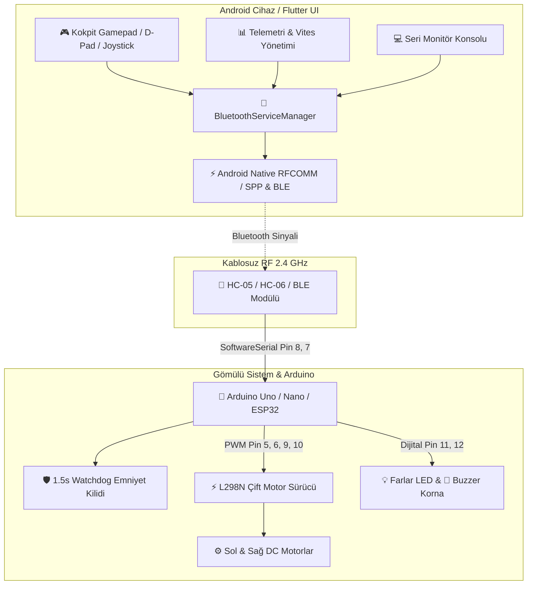

<div align="center">

  

  # 🏎️ KOZA RC Car
  ### *Next-Gen Cockpit Telemetry & Bluetooth Controller for Arduino & Robotics*

  <p align="center">
    <strong>Arduino, ESP32 ve HC-05/06 tabanlı mobil robotlar için geliştirilmiş, profesyonel telemetri ve çift modlu kokpit kontrol uygulaması.</strong>
  </p>

  [](https://flutter.dev)
  [](https://dart.dev)
  [-3DDC84?style=for-the-badge&logo=android&logoColor=white)](https://www.android.com)
  [%20%2B%20BLE-0082FC?style=for-the-badge&logo=bluetooth&logoColor=white)](https://en.wikipedia.org/wiki/Bluetooth)
  [](https://www.arduino.cc)
  [](https://github.com/eekilinc/KozaRcCar/releases)
  [](LICENSE)

  <br />

  [📥 APK İndir (v1.3.2)](#-hızlı-başlangıç--apk-indirme) •
  [✨ Özellikler](#-öne-çıkan-özellikler) •
  [🕹️ Kontroller](#-kokpit--kontroller-rehberi) •
  [🔌 Donanım & Şema](#-donanım-bağlantı-şeması--pin-tablosu) •
  [💻 Seri Monitör](#-canlı-telemetri--dahili-seri-monitör) •
  [🚀 Geliştirici](#-geliştirici-kurulumu)

</div>

---

## 📌 GitHub Repository Meta (About & Topics)

> [!TIP]
> GitHub deponuzun üst panelinde yer alan **About (Açıklama)** ve **Topics (Etiketler)** alanına doğrudan kopyalayabileceğiniz hazır bilgiler:

### 📝 Repository About (Açıklama)
```text
🏎️ Next-Gen Flutter Bluetooth (Classic SPP / BLE) RC Car & Robotics Cockpit Controller with real-time telemetry, serial monitor, E-Stop, and Arduino/ESP32 L298N firmware.
```
*(Türkçe Alternatif: `🏎️ HC-05/06 ve BLE destekli, telemetri, seri monitör ve kokpit arayüzlü gelişmiş Flutter RC araba ve robot kontrol uygulaması.`)*

### 🏷️ Repository Topics (Konular & Etiketler)
```text
flutter, dart, arduino, bluetooth, bluetooth-classic, ble, rc-car, robotics, iot, hc-05, hc-06, esp32, l298n, gamepad, joystick, telemetry, serial-monitor, e-stop, mobile-robotics, embedded-systems
```

---

## 🌟 Öne Çıkan Özellikler

| Özellik | Açıklama |
| :--- | :--- |
| 🎮 **Çift Modlu Kokpit Arayüzü** | Hem dikey hem de yatay (**Landscape Gamepad**) kullanım için optimize edilmiş, taşma yapmayan modern yarış kokpiti tasarımı. |
| 🕹️ **D-Pad & 360° Analog Joystick** | Klasik yön tuşları veya pürüzsüz açı ve hız hissi sunan analog joystick ile sürüş modu seçimi. |
| 🛑 **Acil Durdurma (E-Stop)** | Ağır dokunsal titreşim (Haptic) eşliğinde motorları anında durduran donanımsal emniyet butonu. |
| 📡 **Hibrit Bluetooth Mimarisi** | **Classic Bluetooth (HC-05, HC-06 SPP)** ve **BLE (Bluetooth Low Energy)** protokollerini tek uygulamada birleştiren esnek altyapı. |
| 📊 **Dahili Seri Monitör (Terminal)** | Giden ve gelen TX/RX paketlerini mikrosaniye zaman damgasıyla listeleyen, manuel komut enjekte edebilen gömülü konsol. |
| ⚙️ **Dinamik Vites & Hız Kontrolü** | **ECO**, **NORMAL** ve **SPORT** vites kademeleri, 0-255 arası anlık PWM hassas hız kaydırıcısı (slider & step). |
| 🛡️ **Arduino Watchdog Emniyet Kilidi** | 1.5 saniye boyunca sinyal alınamadığında motorları otomatik durduran yazılımsal güvenlik mekanizması. |
| 💡 **Aydınlatma & Korna Sistemi** | Tek tuşla farları açma/kapama (`L1`/`L0`) ve 500ms asenkron korna (`H1`) darbe tetikleyicisi. |
| 🔊 **Haptik & Ses Efektleri** | Gaz, fren ve aksiyon anlarında fiziksel geri bildirim sağlayan gerçekçi sesler ve titreşim motoru entegrasyonu. |
| 🎛️ **Kişiselleştirilebilir Protokol** | İleri, geri, dönüş, far ve korna karakterlerini dilediğiniz gibi değiştirebileceğiniz ayar ekranı. |

---

## 📸 Ekran Görüntüleri & Önizleme

<div align="center">
  <table>
    <tr>
      <td align="center" width="50%">
        <strong>📱 Kokpit Sürüş Kontrolörü (D-Pad & Telemetri)</strong><br/><br/>
        
      </td>
      <td align="center" width="50%">
        <strong>📲 Hızlı Yükleme (QR Kod)</strong><br/><br/>
        
        <br/><br/>
        <em>Kameranızı açıp taratarak son sürüm APK'yı cihazınıza yükleyebilirsiniz.</em>
      </td>
    </tr>
  </table>
</div>

---

## 📲 Hızlı Başlangıç & APK İndirme

### 1. APK'yı Yükleyin
- [📥 **En Güncel APK'yı Doğrudan İndir (GitHub Releases)**](https://github.com/eekilinc/KozaRcCar/releases/latest)
- Ya da ADB ile doğrudan terminalden kurun:
  ```bash
  adb install app-release.apk
  ```

### 2. Bluetooth Modülünü Eşleştirin
1. Android cihazınızın **Ayarlar** → **Bluetooth** menüsünü açın.
2. `HC-06` veya `HC-05` cihazını aratıp seçin.
3. Eşleştirme PIN kodunu girin (Varsayılan: `1234` veya `0000`).

### 3. Bağlanın ve Gazlayın!
1. **KOZA RC Car** uygulamasını açın.
2. Bağlantı modunu seçin (**Classic Bluetooth** veya **BLE**).
3. Cihaz listesinden robotunuzu seçip **Bağlan** butonuna dokunun.
4. Kokpit ekranında **D-Pad** veya **Joystick** ile kontrolün tadını çıkarın!

---

## 🕹️ Kokpit & Kontroller Rehberi

```
       [ D-PAD MODU ]                     [ JOYSTICK MODU ]
            ▲                                    ▲
            | [F]                                |
     ◄------+------►                      ◄------+------►
    [L]     |     [R]                    360° Analog Hassasiyet
            ▼                                    ▼
           [B]
```

### Temel Sürüş Fonksiyonları
- **İleri (`F`) / Geri (`B`)**: Aracı ileri veya geri sürer.
- **Sol (`L`) / Sağ (`R`)**: Diferansiyel veya yönlendirilebilir tekerlek dönüşünü sağlar.
- **Fren / Dur (`S`)**: Tüm motorları durdurur. Tuş bırakıldığında otomatik gönderilir.
- **🛑 E-STOP Butonu**: Acil durumlarda tek dokunuşla sert fren uygular ve haptik uyarı verir.

### Kokpit Telemetri ve Yardımcı Butonlar
- **💡 Far Butonu (LED)**: Ön far aydınlatmasını açar (`L1`) veya kapatır (`L0`).
- **📣 Korna (Horn)**: 500ms süreli ikaz sinyali gönderir (`H1`).
- **🏎️ Hız & Vites Göstergesi**: 
  - `ECO` (0 - 100 PWM) — Düşük hız, hassas manevra.
  - `NORMAL` (101 - 190 PWM) — Standart dengeli sürüş.
  - `SPORT` (191 - 255 PWM) — Maksimum güç ve çeviklik.
- **📟 Seri Monitör (Terminal)**: Sağ üstteki konsol simgesinden gerçek zamanlı veri akışını izleyin.

---

## 💻 Canlı Telemetri & Dahili Seri Monitör

Geliştiriciler ve robotik yarışmacıları için dahili terminal konsolu:
- **TX (Giden Veri)**: Uygulamadan araca gönderilen her karakter ve komut mavi zaman damgasıyla listelenir.
- **RX (Gelen Veri)**: Araçtan gelen telemetri, sensör verileri veya yanıtlar yeşil renkte gösterilir.
- **Manuel Enjeksiyon**: İletişim hattına dilediğiniz özel karakter dizisini (örn: `V200`, `L1`, `H1`) manuel olarak basabilirsiniz.
- **Log Temizleme**: Tek dokunuşla konsol belleğini sıfırlama imkanı.

---

## 🔌 Donanım Bağlantı Şeması & Pin Tablosu

Proje, standart **Arduino Uno / Nano** ve **L298N Çift Motor Sürücü** mimarisine göre yapılandırılmıştır.

### 📌 Pin Konfigürasyon Tablosu

| Arduino Pini | Modül / Bileşen | Bağlantı Pini | Açıklama |
| :--- | :--- | :--- | :--- |
| **Pin 8 (RX)** | HC-06 / HC-05 | **TXD** | Bluetooth'tan Arduino'ya veri girişi *(SoftwareSerial)* |
| **Pin 7 (TX)** | HC-06 / HC-05 | **RXD** | Arduino'dan Bluetooth'a veri çıkışı *(Direnç bölücü ile 3.3V)* |
| **Pin 5 (PWM)** | L298N Sürücü | **IN1** | Sol Motor İleri Yön PWM |
| **Pin 6 (PWM)** | L298N Sürücü | **IN2** | Sol Motor Geri Yön PWM |
| **Pin 9 (PWM)** | L298N Sürücü | **IN3** | Sağ Motor İleri Yön PWM |
| **Pin 10 (PWM)** | L298N Sürücü | **IN4** | Sağ Motor Geri Yön PWM |
| **Pin 11** | LED / Ön Far | **Anot (+)** | Farların açılıp kapatılması |
| **Pin 12** | Buzzer / Korna | **Pozitif (+)** | Sesli ikaz sinyali |
| **5V / 3.3V** | HC-06 Modülü | **VCC** | Modül beslemesi |
| **GND** | Tüm Bileşenler | **GND** | **Ortak Toprak Hattı (Ortak GND Şarttır!)** |

> [!WARNING]
> **Ortak GND (Common Ground) Kuralı:** Motorları harici bir pille (örn. 2x 18650 Li-ion veya 9V/12V batarya) beslerken, pilin eksi kutbunu (-) mutlaka Arduino GND pinine bağlayınız. Aksi halde sinyal referansı oluşmaz ve motorlar komut alamaz.

---

## 📡 Haberleşme Protokolü (Command Reference)

Uygulama ile mikrodenetleyici arasında düşük gecikmeli, tek baytlık ve parametrik komut yapısı kullanılır:

| Komut | Parametre | Açıklama | Örnek |
| :---: | :---: | :--- | :---: |
| `F` | - | İleri hareket (Forward) | `'F'` |
| `B` | - | Geri hareket (Backward) | `'B'` |
| `L` | - | Sola dönüş (Turn Left) | `'L'` |
| `R` | - | Sağa dönüş (Turn Right) | `'R'` |
| `S` | - | Motorları Durdur (Stop) | `'S'` |
| `L0` | 0 | Ön Far LED'ini Kapat | `"L0"` |
| `L1` | 1 | Ön Far LED'ini Aç | `"L1"` |
| `H1` / `H` | - | Kornayı 500 ms Çal (Horn Pulse) | `"H1"` |
| `V` | 000 - 255 | PWM Hız Değerini Ayarla (0-255) | `"V170"` |

---

## 🏗️ Sistem Mimarisi



---

## 📁 Proje Dosya Yapısı

```
koza_rc_car/
├── android/                    # Native Android yapılandırması & Bluetooth servisleri
├── assets/
│   ├── images/
│   │   └── koza_logo.png       # Vektörel uygulama amblemi
│   └── sounds/                 # Gaz, fren ve korna ses efektleri
├── lib/
│   ├── main.dart               # Uygulama başlangıç noktası ve tema tanımları
│   ├── models/
│   │   └── command_config.dart # Özelleştirilebilir komut eşleme modeli
│   ├── pages/
│   │   ├── about_page.dart     # Hakkında ve geliştirici bilgileri
│   │   ├── command_settings_page.dart # Tuş ve protokol yapılandırması
│   │   ├── device_selection_page.dart # Bluetooth tarama ve cihaz seçimi
│   │   ├── rc_car_controller_page.dart# Kokpit sürüş, telemetri & Gamepad
│   │   └── settings_page.dart  # Genel ayarlar (ses, titreşim, tema)
│   ├── services/
│   │   ├── bluetooth_service.dart     # Çift modlu Bluetooth yöneticisi
│   │   ├── connection_stats.dart      # Canlı bağlantı & telemetri istatistikleri
│   │   └── sound_service.dart         # Ses efektleri servisi
│   ├── utils/
│   │   └── logger.dart         # Hata ayıklama ve loglama aracı
│   └── widgets/
│       ├── dpad_controller.dart       # 4 yönlü D-Pad bileşeni
│       ├── joystick_controller.dart   # 360° analog joystick kontrolörü
│       └── serial_monitor_dialog.dart # Dahili seri monitör arayüzü
├── arduino_sketch.ino          # Emniyet kilitli ve non-blocking Arduino yazılımı
├── pubspec.yaml                # Paket ve bağımlılık manifestosu
└── README.md                   # Proje dokümantasyonu
```

---

## 🚀 Geliştirici Kurulumu

Projeyi kaynak koddan derlemek ve katkıda bulunmak için:

### Gereksinimler
- **Flutter SDK**: `^3.10.0` veya üzeri
- **Dart SDK**: `^3.0.0` veya üzeri
- **Android Studio / VS Code**: Flutter & Dart eklentileri kurulu
- **Arduino IDE**: 1.8.x veya 2.x

### Adım Adım Kurulum

1. **Depoyu klonlayın:**
   ```bash
   git clone https://github.com/eekilinc/KozaRcCar.git
   cd KozaRcCar
   ```

2. **Bağımlılıkları yükleyin:**
   ```bash
   flutter pub get
   ```

3. **Uygulamayı hata ayıklama modunda çalıştırın:**
   ```bash
   flutter run
   ```

4. **Yayın (Release) APK'sı oluşturun:**
   ```bash
   flutter build apk --release
   ```

5. **Arduino Kodunu Yükleyin:**
   - [arduino_sketch.ino](arduino_sketch.ino) dosyasını Arduino IDE ile açın.
   - Kartınızı (`Arduino Uno/Nano`) ve doğru Port'u seçin.
   - Yükleme yaparken Arduino'nun `0 (RX)` ve `1 (TX)` pinlerine kablo takılı olmadığından emin olun (SoftwareSerial kullandığımız için Pin 8 ve 7'dedir).
   - **Yükle (Upload)** butonuna basın.

---

## ❓ Sık Sorulan Sorular (FAQ) & Sorun Giderme

<details>
<summary><strong>1. Bluetooth taramasında HC-05 veya HC-06 cihazım görünmüyor?</strong></summary>

Android 12 ve üzeri sürümlerde Bluetooth taraması için **"Yakındaki Cihazlar" (Nearby Devices)** ve **"Konum"** izinlerinin verilmiş olması zorunludur. Cihazınızı önce telefonunuzun kendi Bluetooth ayarlarından eşleştirip ardından uygulamadaki **"Eşlenmiş Cihazlar"** sekmesinden bağlanmayı deneyin.
</details>

<details>
<summary><strong>2. Komut gönderildiğinde motorlar dönmüyor ama ses/LED tepki veriyor?</strong></summary>

Bu durum %99 oranında **güç yetersizliğinden** veya **ortak GND eksikliğinden** kaynaklanır:
- L298N motor sürücüsünü Arduino'nun 5V pininden beslemeyin; motorlar yüksek akım çeker. Harici 7.4V - 12V batarya kullanın.
- Harici bataryanın eksi (-) ucunu Arduino'nun **GND** pinine bağladığınızdan (Ortak Toprak) emin olun.
</details>

<details>
<summary><strong>3. Watchdog Failsafe nedir ve neden motorlar kendiliğinden duruyor?</strong></summary>

Aracınız Bluetooth menzilinden çıktığında veya telefonunuz kapandığında robotun kontrolden çıkıp duvara çarpmasını engellemek için `arduino_sketch.ino` içerisinde **1500 ms Watchdog** koruması bulunmaktadır. Son komutun üzerinden 1.5 saniye geçtiğinde motorlar emniyet gereği otomatik olarak durdurulur.
</details>

<details>
<summary><strong>4. Baud hızı uyumsuzluğu nasıl giderilir?</strong></summary>

HC-06 modülleri fabrika çıkışı genellikle `9600` baud rate ile gelir. `arduino_sketch.ino` içerisinde `hc06.begin(9600);` ayarlanmıştır. Eğer HC-05 modülünüz farklı bir hızda yapılandırıldıysa (örn: 38400), koddaki baud hızını modülünüze göre güncelleyin.
</details>

---

## 🤝 Katkıda Bulunma

Topluluk katkıları projeyi daha da ileriye taşır!
1. Bu depoyu Fork'layın (`Fork`).
2. Özellik dalınızı oluşturun (`git checkout -b feature/harika-ozellik`).
3. Değişikliklerinizi commit'leyin (`git commit -m 'feat: Yeni sürüş modu eklendi'`).
4. Dalınıza push yapın (`git push origin feature/harika-ozellik`).
5. Bir **Pull Request (PR)** açın.

---

## 📄 Lisans

Bu proje **[MIT Lisansı](LICENSE)** kapsamında lisanslanmıştır. Açık kaynak kodlu olup, eğitim ve hobi amaçlı projelerinizde özgürce kullanabilir ve geliştirebilirsiniz.

---

<div align="center">
  <sub>Tasarım ve Geliştirme: <strong>KOZA RC Car Project</strong> • 2025 - 2026</sub><br/>
  <strong>⭐ Beğendiyseniz depoya bir yıldız bırakmayı unutmayın! ⭐</strong>
</div>
